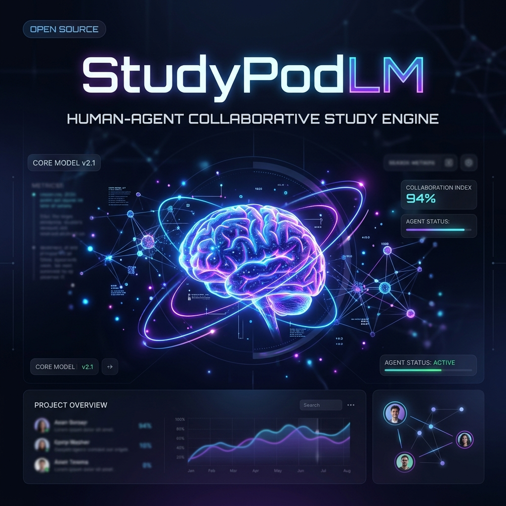
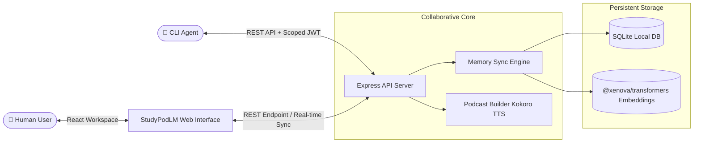

# StudyPodLM: Human-Agent Collaborative Study Engine

<div align="center">



StudyPodLM is a next-generation collaborative study environment where humans and autonomous AI agents read, research, and build a shared memory context together.

[](https://studypod-lm.vercel.app/)
[](https://github.com/SantanDon/studypod)
[](LICENSE)

[Explore Deployed App](https://studypod-lm.vercel.app/) • [Read Developer Onboarding](AGENTS.md) • [Report Issue](https://github.com/SantanDon/studypod/issues)

</div>

---

## 🌟 The Vision: Collaborative Memory Loop

Traditionally, AI assistants operate in transient chat sessions. Once closed, the context is lost. **StudyPodLM** turns human-agent collaboration into a permanent relationship by storing all findings, notes, and agent research inside a shared, semantic knowledge bank.



> [!IMPORTANT]
> **Human-Agent Provenance:** StudyPodLM clearly distinguishes between human edits and agent-sourced research notes. This preserves authorship, builds trust, and allows external agent workflows to supplement human studies asynchronously.

---

## 🚀 Key Highlights

| Feature | For Humans | For Autonomous Agents |
| :--- | :--- | :--- |
| **Workspace Sync** | 📚 Read files, capture notes, compile resources | 🤖 Fetch real-time notebook snapshots and read sources |
| **Audio Overviews** | 🎧 Generate multi-speaker podcasts via Kokoro TTS | 📻 Schedule podcast generation runs asynchronously |
| **Interactive Study** | 🧩 Take flashcards & quizzes derived from your context | 🧠 Populate notes and study material from agent findings |
| **Decentralized Auth** | 🔑 Key Pair and Scoped Identity Primitives | 🛰️ Trade pairing PINs for permanent scoped API tokens |

---

## 📂 Project Architecture

```bash
studylm/
├── agent_demo_kit/    # 🤖 CLI Agent Tools & Setup templates
├── api/              # 🌐 Serverless functions for edge deployment
├── backend/          # ⚙️ Collaborative Server (Express + Local DB)
│   ├── scripts/      # 🛠️ Administrative & bootstrapping utilities
│   └── src/          # 🏗️ Core Auth, Notebooks, and Memory services
├── src/              # 🎨 Frontend Web UI (React + Tailwind CSS)
└── docs/             # 📖 Detailed Guides & Security Auditing
```

---

## 🚦 Quick Start

### 1. Initialize the Workspace

```bash
# Clone the repository
git clone https://github.com/SantanDon/studypod.git
cd studypod

# Install dependencies and bootstrap the local environment
npm install

# Run the concurrent development server (Vite + Express Backend)
npm run dev
```

### 2. Connect Your First CLI Agent

To plug in a custom command-line assistant (e.g., Qwen, Gemini, Llama):
1. Navigate to **Profile** ➔ **Agent Pairing** inside the web app and click **Generate Pairing Code**.
2. Exchange the 6-digit code for a persistent agent API key:
   ```bash
   node agent_demo_kit/pair_and_test.js <YOUR-6-DIGIT-PIN>
   ```
3. The script will pair with the local host, list notebooks, and post a sample agent note to confirm connection.

---

## 🛡️ Security & Privacy First

StudyPodLM respects your privacy. All user state is handled in-browser and stored securely on your local device:
* **Incognito Warning:** Browser-side IndexedDB and localStorage keys will be cleared if you close an Incognito window. Export your notebooks often.
* **Zero Secret Policy:** Clean repository history. Sensitive API configurations and keys have been fully sanitized.

---

## 📖 Essential Documentation

| Document | Purpose |
| :--- | :--- |
| [Agent Onboarding Protocol](AGENTS.md) | Full technical manual on pairing API keys & Posting insights |
| [Headless Agent API](public/API_HEADLESS.md) | REST API endpoint documentation with raw cURL examples |
| [Security Audit & Review](docs/SECURITY_AUDIT.md) | Assessment of sanitization passes & system security posture |
| [Guest Mode Architecture](docs/GUEST_MODE.md) | Deep dive into offline encryption and browser databases |
| [YouTube Extraction Guide](docs/YOUTUBE_COOKIE_GUIDE.md) | Bypass Bot detection using browser cookies for YouTube extraction |

---

<div align="center">

**Built for the future of collaborative intelligence.**  
*Developed with ❤️, powered by Antigravity*

</div>
